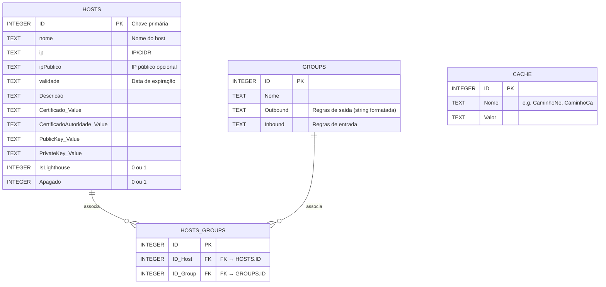
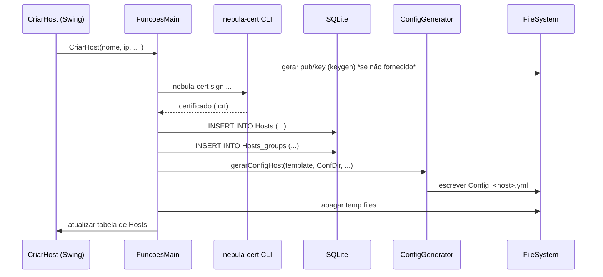

# Documentação do **Gerenciador Nebula VPN** 📘

Este projeto é um gerenciador que simplifica o uso do Nebula VPN, automatizando tarefas como criação de hosts, gestão de caminhos de executáveis e certificados, grupos de firewall e geração de configurações YAML. Todo o estado é persistido em um banco SQLite local, evitando ao usuário lidar manualmente com vários arquivos.

---

## Índice

1. [Visão Geral](#visão-geral)  
2. [Arquitetura](#arquitetura)  
   2.1. [Diagrama de Entidades (ER)](#diagrama-de-entidades-er)  
   2.2. [Fluxo de Criação de Host](#fluxo-de-criação-de-host)  
3. [Módulos Centrais](#módulos-centrais)  
   3.1. [FuncoesMain.java](#funcoesmainjava)  
   3.2. [ConfigGenerator.java](#configgeneratorjava)  
   3.3. [FirewallRuleParser.java](#firewallruleparserjava)  
   3.4. [BlockRepresenter.java](#blockrepresenterjava)  
4. [Modelo de Dados](#modelo-de-dados)  
   4.1. [Grupo.java](#grupojava)  
   4.2. [Valores.java](#valoresjava)  
5. [Interface Gráfica (Swing)](#interface-gráfica-swing)  
   5.1. [MenuPrincipal](#menuprincipal)  
   5.2. [CriarHost](#criarhost)  
   5.3. [GerirCa & CriarCa](#gerirca--criarca)  
   5.4. [Grupos](#grupos)  
   5.5. [InfoHosts & StaticHostMap](#infohosts--statichostmap)  
6. [Conclusão e Uso](#conclusão-e-uso)  

---

## 1. Visão Geral

O **Gerenciador Nebula VPN** permite que o usuário:

- ⚙️ **Crie hosts** Nebula (`CriarHost`), gerando chaves, assinando com CA e armazenando tudo em uma base de dados.  
- 📁 **Gerencie os caminhos** para o executável `nebula-cert` e para o arquivo do certificado de autoridade (CA), facilitando a configuração do ambiente (`GerirCa`, `CriarCa`).  
- 🛡️ **Configure regras de firewall** através de grupos (`Grupos`, `GestorGrupos`, `FirewallRuleParser`).  
- 📄 **Gere automaticamente arquivos YAML** de configuração (`ConfigGenerator`).  
- 🖥️ **Visualize e renove** configurações de hosts existentes (`InfoHosts`, `StaticHostMap`).  

Tudo isso com uma interface Swing amigável, escondendo detalhes de arquivos temporários e comandos CLI do Nebula.

---

## 2. Arquitetura

A seguir, um panorama de como os componentes se relacionam, tanto na camada de persistência (SQLite) quanto no fluxo de criação de um host.

### 2.1. Diagrama de Entidades (ER)



### 2.2. Fluxo de Criação de Host



---

## 3. Módulos Centrais

### 3.1. FuncoesMain.java ⚙️

Classe “coração” do sistema, responsável por:

- ✨ Iniciar a base de dados SQLite e criar tabelas (`main()`).  
- 🔗 Operações CRUD em tabelas `Hosts`, `Groups`, `Hosts_groups`, `Cache`.  
- 🔑 Invocar o CLI `nebula-cert` para geração de chaves e assinaturas.  
- 🗄️ Serialização de chaves/certificados e persistência em BD.  
- 📋 Geração de tabela Swing (`carregarTabelaHosts()`, `carregarTabelaGrupos()`).  
- 🛠️ Métodos utilitários: `hostJaExiste()`, `GrupoJaExiste()`, `AutopreencherIp()`, `RenovaData()`, etc.

Exemplo de chamada para criar host:
```java
FuncoesMain.CriarHost(
    "host1", "10.0.0.5/24", false,
    vlr.getCaminhoNe(), vlr.getCaminhoCa(),
    "720h", "Servidor App", "192.168.1.10:4242",
    new Date()
);
```

### 3.2. ConfigGenerator.java 📄

Gera arquivos YAML de configuração do Nebula a partir de:

- Modelo (`ConfigHost.yml`) embutido no JAR.  
- Parâmetros: certificados, chaves, IPs, papel de *lighthouse*, regras de firewall.  
- Consulta ao BD para obter **inbound/outbound** de grupos associados.  
- Uso de **SnakeYAML** com `BlockRepresenter` para formatação legível.

Fluxo interno:
1. Carrega `templatePath`.  
2. Atualiza seções `pki`, `static_host_map`, `lighthouse`, `firewall`.  
3. Escreve `Config_<host>.yml` em `ConfDir`.

### 3.3. FirewallRuleParser.java 🔒

Converte *strings* de regras no formato:
```
port|proto|dest<Tipo>;
...
```
em `List<Map<String,Object>>`, para alimentar o YAML:

```java
List<Map<String,Object>> regras = FirewallRuleParser.parseRules(
  "80|tcp|10.0.0.1<Host>;" +
  "5432|tcp|Web<group>;"
);
```

### 3.4. BlockRepresenter.java 📦

Estende `Representer` do SnakeYAML para forçar estilo **BLOCK** em sequências e mapeamentos, garantindo YAML indentado (legível).

---

## 4. Modelo de Dados

### 4.1. Grupo.java

Simples *DTO* que armazena as **strings** bruto de inbound/outbound de um grupo:
```java
public class Grupo {
  private final String inbound, outbound;
  // getters...
}
```

### 4.2. Valores.java

Recupera do BD (`Cache`) os caminhos salvos para:

- `CaminhoNe` (nebula-cert)
- `CaminhoCa` (certificado de autoridade)

para uso global em `FuncoesMain`.

---

## 5. Interface Gráfica (Swing) 🖥️

Cada janela possui arquivo `.form` (layout) e `.java` (lógica de eventos).

### 5.1. MenuPrincipal

- **Botões**: Criar Host, Grupos, Gerir caminhos, Criar Configs.  
- **Tabela**: exibe hosts ativos com colunas:
  `Nome`, `IP`, `Validade`, `Descrição`, `Lighthouse`, `❌`.  
- **Ações**:
  - Duplo-click no nome → abre `InfoHosts`.
  - Click no ❌ → exclui host.

---

### 5.2. CriarHost

- Campos obrigatórios: **Nome**, **IP**, **Grupo**.  
- Validação ao digitar (regex, feedback visual).
- **Checkbox LightHouse**:
  - Quando marcado, **torna obrigatório** o preenchimento do campo **IP Público**.
  - Se o campo **Porta** estiver vazio, é autopreenchido com o valor `0`.
  - No banco de dados, o host é registrado com o campo `IsLighthouse=1`, o que altera o papel deste host em toda a aplicação:
    - Hosts marcados como Lighthouse são diferenciados tanto nas regras de configuração quanto em funcionalidades extra (por exemplo, fazem parte da lista de *static_host_map* de outros hosts).
    - A geração do arquivo de configuração (`ConfigGenerator`) monta o YAML de forma distinta para hosts Lighthouse, incluindo as seções apropriadas, como a flag `am_lighthouse` e a configuração de hosts e IPs.
    - Apenas hosts Lighthouse podem ser referência para outros hosts como *Lighthouses* na topologia da VPN.
- Botão 🔍 para importar **.pub** existente.
- Ao criar:
  1. Validações (`ProcurandoErros()`, `tratandoErros()`).
  2. Chama `FuncoesMain.CriarHost`, que armazena o tipo do host e monta o relacionamento Lighthouse na configuração.
  3. Reseta formulário.

---

### 5.3. GerirCa & CriarCa

- **GerirCa**:
  - Permite ao usuário **definir e alterar os caminhos** do executável `nebula-cert` e do arquivo de certificado de autoridade (CA) `.crt`.
  - Realiza validação básica para garantir que os caminhos indicados apontam para arquivos válidos e executáveis, verificando inclusive a autenticidade do `nebula-cert`.
  - Se o usuário não possuir CA, o botão **Clique aqui** abre a tela `CriarCa` para criação de um novo certificado de autoridade.
- **CriarCa**:
  - Solicita nome da nova CA.
  - Cria par `.crt/.key` via `nebula-cert ca`, com caminho de destino definido pelo usuário.

---

### 5.4. Grupos

- Lista de **Grupos** com inbound/outbound e hosts associados.  
- Permite:
  - Adicionar novo grupo (`TxtNome` + `Adicionar`).
  - Editar regras via `JTable` com última linha editável (`GestorGrupos.LastRowEditableModel`).
  - Menu no header para alternar coluna **Host/Group**.  
  - Botão **Gravar** persiste em BD (`INSERT` ou `UPDATE`).

---

### 5.5. InfoHosts & StaticHostMap

- **InfoHosts**:
  - Insere nome do host → carrega config YAML (`FuncoesMain.EscreverConfig`).
  - Exibe IP, validade, e área de texto editável do YAML.
  - Botões:
    - **Padrão**: recarrega do arquivo em `ConfDir`.
    - **Gravar**: salva em local à escolha + atualiza `ConfDir`.
    - **Renovar**: escolhe nova data e re-assina certificado (`FuncoesMain.RenovaData`).
    - **Lighthouse**: abre `StaticHostMap`.
- **StaticHostMap**:
  - Permite **adicionar** hosts *lighthouse* manualmente ou **auto preencher** todos.

---

## 6. Conclusão e Uso

1. Instale o **Java** e o **nebula-cert** no seu sistema.  
2. Execute o JAR do Gerenciador:  
   ```bash
   java -jar GerenciadorNebulaVPN.jar
   ```  
3. Em **Gerir caminhos**, aponte para:
   - Executável `nebula-cert`  
   - Arquivo `.crt` da CA (ou crie uma nova).  
4. Use **Criar Host** para adicionar nós VPN.  
5. Em **Grupos**, defina regras de firewall.  
6. Gere configurações via **Criar Configs** ou diretamente ao criar host.  
7. Em **Informações Hosts**, revise e renove certificados conforme necessário.

Bom uso! 🚀